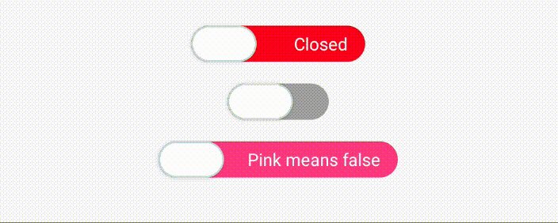

# :snail: React native Custom Switches

A library (in construction) with several (not yet) switches options for React Native projects.

This lib uses only React Native Animated.

## Install

```
npm install react-native-custom-switches
```

## Usage

Select the switch that you like (see options in 'Available switches'), import and have fun.

### Available Switches

#### Labeled switch



Example:

```
import React, {useState} from 'react';
import {View, Text} from 'react-native';
import LabeledSwitch from 'react-native-custom-switches/LabeledSwitch';

export default function App() {
  const [state, setState] = useState(false);
  return (
    <View style={{padding: 20, alignItems: 'center'}}>
      <LabeledSwitch
        value={state3}
        onChange={setState3}
        disabledColor="#f35588"
        enabledColor="#05dfd7"
        disabledLabel="Pink means false"
        enabledLabel="Blue means true"
        width={165}
      />
    </View>
  );
}
```

Props:

| Props              | Type     | Default  | Description                    |
| ------------------ | -------- | -------- | ------------------------------ |
| value              | boolean  | false    | state of the switch            |
| onChange           | function | () => {} | function to update the _value_ |
| enabledLabel       | string   | Opened   | label for _true_ value         |
| disabledLabel      | string   | Closed   | label for _false_ value        |
| enabledLabelColor  | string   | #fff     | label color for _true_ value   |
| disabledLabelColor | string   | #fff     | label color for _false_ value  |
| enabledColor       | string   | #00b33   | color for _true_ value         |
| disabledColor      | string   | #ff3333  | color for _false_ value        |
| width              | number   | 120      | width of the switch            |
| duration           | number   | 400      | timing to execute animation    |
